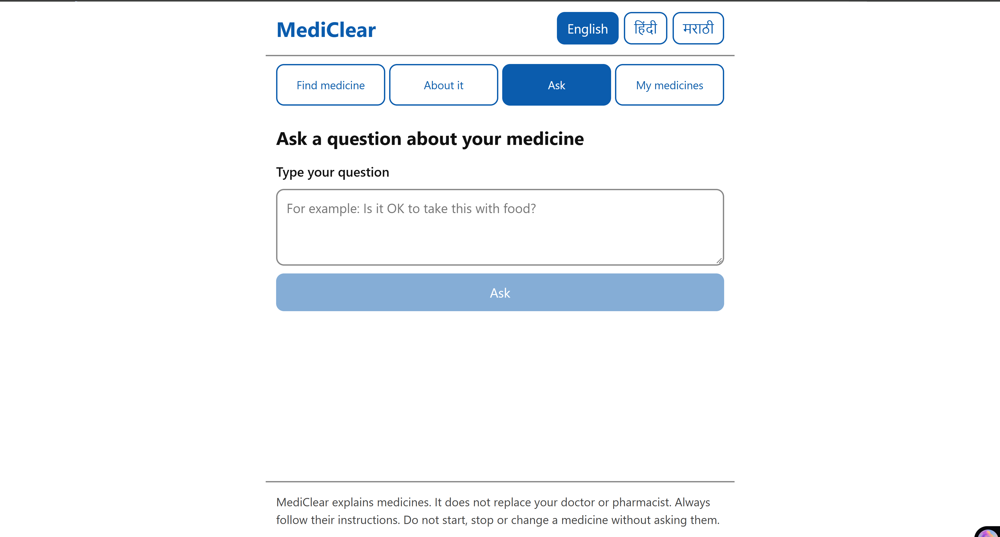

# MediClear 💊

**Explains medicines in simple English, Hindi and Marathi for elderly patients in India.**
Scan or type a medicine name, read or listen to what it is for, ask questions safely,
and check your saved medicines for dangerous combinations.

🔗 **Live demo:** https://mediclear-project-y0yv.onrender.com

🎥 **Demo video:** [Watch on Youtube](https://www.youtube.com/watch?v=bRREjzoEUZg)

<p align="center">
  
  
  
</p>

> Free hosting: the first visit after a while can take about a minute to wake up.
> Saved medicines are reset whenever the app is redeployed.
> Free hosting: the first visit after a while can take about a minute to wake up.
> Saved medicines are reset whenever the app is redeployed.

> ⚠️ MediClear explains medicines. It does not replace your doctor or pharmacist.

---

## Features

| Screen | What it does |
| --- | --- |
| **Find medicine** | Type a brand name or take a photo of the strip; the brand and active ingredients are identified |
| **About it** | What it's for, how to take it, what to avoid, side effects, when to see a doctor, with audio in all 3 languages |
| **Ask** | Every question goes through a safety router; emergencies show a large **Call 112** button |
| **My medicines** | Saved list with interaction alerts (duplicate ingredients, risky pairs, timing) |

Designed for elderly users: 20px base text, large buttons, high contrast, translated error messages,
and alerts that never rely on colour alone.

## Safety design

The AI (Gemini) **never invents medical facts**. It only:
1. reads the text on a strip photo, and the result is checked against the database before it's accepted,
2. sorts questions into safety categories (emergency, ask your doctor, answer from database, out of scope), and
3. translates verified English text into Hindi and Marathi.

All medical content comes from a hand-verified knowledge base (24 active ingredients, 23 Indian brands,
33 interaction pairs), and every fact links to its source.

| Eval | Test cases | Result |
| --- | --- | --- |
| Safety router | 25 questions | 25/25 correct, **0 unsafe answers** |
| Photo reading | 10 real strip photos | 10/10 correct, **0 "wrong but confident"** |

## Tech stack

- **Backend:** Python, FastAPI, SQLite (SQLModel), Google Gemini (`google-genai`), gTTS, RapidFuzz
- **Frontend:** React, TypeScript, Vite
- **Quality:** pytest, ruff, ESLint, GitHub Actions CI (tests use a fake LLM, so no API key is needed)
- **Deployment:** Docker on Render; FastAPI serves both the API and the built frontend

## Project structure

```
backend/app/        FastAPI app: routers, matcher, interaction checks, safety router, Gemini client, TTS
backend/tests/      pytest tests
data/               verified drugs, brands and interactions (JSON)
eval/               safety and photo-reading evals (use the real Gemini API)
frontend/src/       React app: screens/, components/, api.ts, i18n.ts
Dockerfile          builds the frontend, then runs the backend that serves it
```

## Run locally

**Requirements:** Python 3.14, Node 24, a Gemini API key

1. **Backend** (from the project root):
   ```bash
   cd backend
   python -m venv .venv
   .venv\Scripts\activate          # Windows (macOS/Linux: source .venv/bin/activate)
   pip install -r requirements.txt
   ```
   Copy `.env.example` (in the project root) to `.env` and add your `GEMINI_API_KEY`. Then:
   ```bash
   uvicorn app.main:app --reload
   ```
2. **Frontend** (in a second terminal):
   ```bash
   cd frontend
   npm install
   npm run dev
   ```
3. Open http://localhost:5173

**Run the tests:** `cd backend` → `pytest -q` and `ruff check .` · `cd frontend` → `npm run lint` and `npm run build`

**Run with Docker:**
```bash
docker build -t mediclear .
docker run --rm -p 8000:8000 --env-file .env mediclear
```
Then open http://localhost:8000

## What's next

- More medicines and brands, reviewed by a pharmacist
- Native-speaker review of the Hindi and Marathi text, then more Indian languages
- Medicine reminders, and sharing the list with family or a doctor